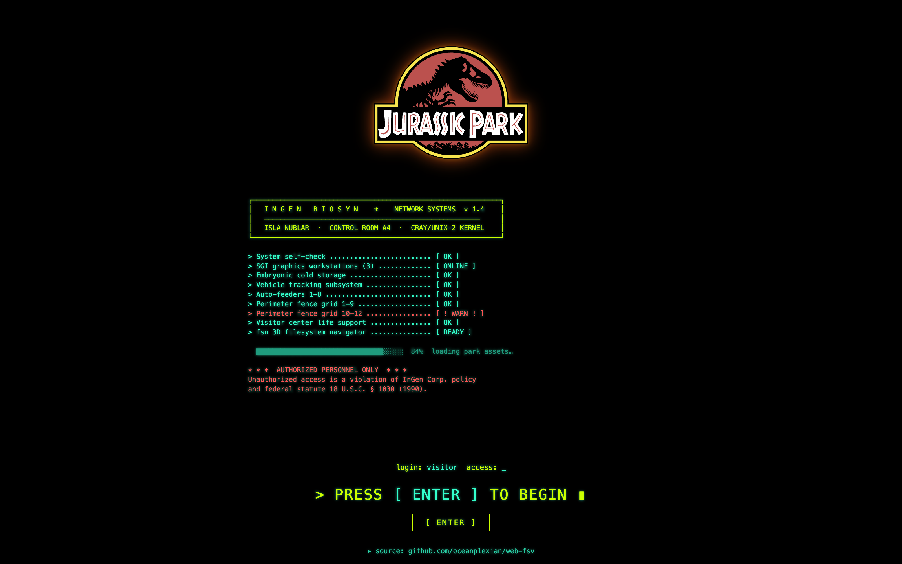
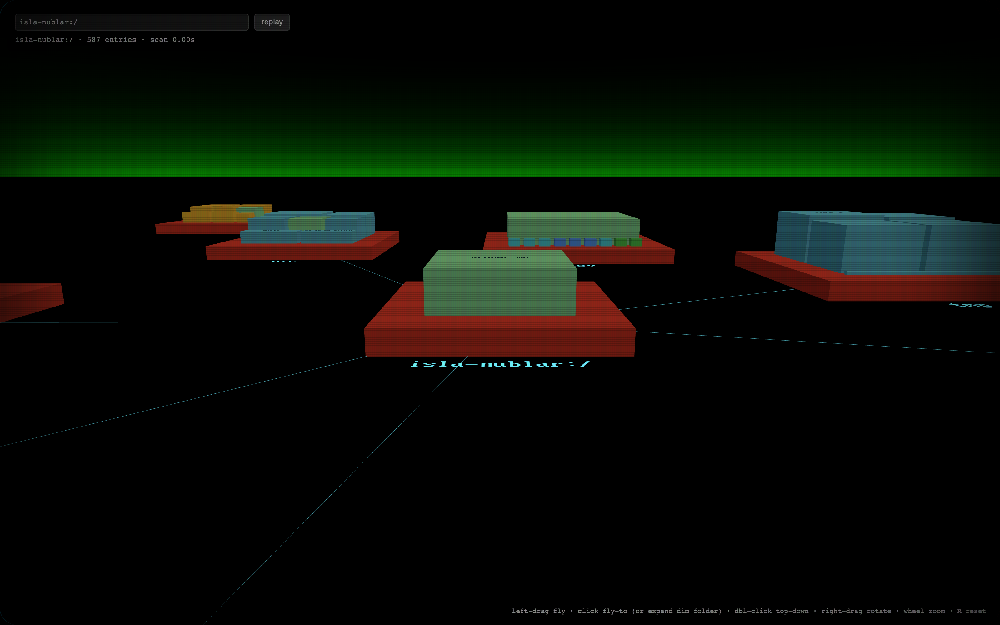

<h1 align="center">web-fsv</h1>

<p align="center">
  <strong>It's a UNIX system. I know this.</strong><br>
  A 3D file-system visualizer in cyberspace — a browser port of
  <a href="http://fsv.sourceforge.net/">fsv</a>, the descendant of SGI's
  <code>fsn</code> from <em>Jurassic Park</em>. Built with Three.js and a tiny
  Node server. No build step, no framework.
</p>

<p align="center">
  <a href="https://dino.fieldio.com">▸ Live demo</a> ·
  <a href="#quick-start">Quick start</a> ·
  <a href="#controls">Controls</a> ·
  <a href="#deploy-to-aws-lambda">Deploy</a>
</p>

<p align="center">
  
  
</p>

---

Directories become coral **platforms** laid out on a radial tree; files are
cyan **tiles** packed onto their directory's platform, sized by byte count and
colored by type. You fly through it. The hosted demo renders a bundled
recreation of the InGen / Isla Nublar control system — the SGI box Nedry
sabotaged — so you can poke around `/usr/local/ingen/`, the dinosaur paddocks,
the embryo cold storage, and `whte_rabbt.obj` without it costing you the park.

## Quick start

Requires Node 18+.

```bash
git clone https://github.com/oceanplexian/web-fsv.git
cd web-fsv
npm install
npm start            # serves the Jurassic Park demo on http://localhost:8765
```

Open <http://localhost:8765> and hit **Enter** at the boot prompt.

### Visualize your own filesystem

The same server can walk a real directory on your machine instead of the demo
tree:

```bash
FSV_SOURCE=files npm start
# then open: http://localhost:8765/?path=/your/directory&maxDepth=4
```

Type a path into the box and hit **scan**, or pass `?path=…` in the URL. Dim
platforms are unexpanded — click them to lazily scan deeper.

| Env var | Default | Description |
|---|---|---|
| `FSV_SOURCE` | `demo` | `demo` (bundled Isla Nublar tree), `files` (walk the real local filesystem), or `hass` (Home Assistant — see below) |
| `PORT` | `8765` | HTTP listen port |
| `HOST` | `0.0.0.0` | Bind address |
| `HASS_URL` | `http://homeassistant.local:8123` | Home Assistant base URL (`hass` mode) |
| `HASS_TOKEN` | *(none)* | Home Assistant long-lived access token (`hass` mode) |

`files` mode reads your filesystem locally and never leaves your machine. The
hosted demo only ever serves the bundled tree — it has no filesystem access and
no secrets.

### Visualize your Home Assistant

`hass` mode turns the visualizer into a live control surface for your own Home
Assistant: **areas become rooms** (platforms), **devices become tiles** sized by
activity and colored by state, and **double-clicking a tile toggles it** (lights,
switches, fans, covers, locks, scenes, …). Tile colors update in real time as
states change.

1. In Home Assistant, open your **profile → Security → Long-lived access tokens**
   and create a token.
2. Run with your URL + token in the environment:

   ```bash
   FSV_SOURCE=hass \
   HASS_URL=http://homeassistant.local:8123 \
   HASS_TOKEN=eyJ...your-token... \
   npm start
   ```

   Then open <http://localhost:8765>.

Credentials are read **only** from `HASS_URL` / `HASS_TOKEN` at runtime —
nothing is stored, hardcoded, or written to disk. Keep your token in your
environment (or a local `.env` that you never commit); `.env` is gitignored.
This mode talks directly to your HA instance, so run it where it can reach HA
(your LAN), not on the public demo.

## Controls

| Input | Action |
|---|---|
| **left-drag** | fly (forward/back + strafe) |
| **click** | fly to a node — or expand a dim (unscanned) folder |
| **double-click** | drop to a top-down view of that folder |
| **right-drag** | orbit / rotate |
| **scroll** | zoom |
| **arrow keys** | step between neighboring platforms |
| **Enter** | top-down on the selected node |
| **Esc** | frame the root (double-tap: frame everything) |
| **R** | reset to the canonical FSN viewing angle |

## How it works

```
server.js            tiny Node http server: static files + /scan + /config
public/index.html    the InGen boot splash + canvas + import map
src/                 the Three.js app
  main.js              camera, input, render loop
  layout.js            radial-tree + squarified-treemap layout
  scene.js             builds meshes, labels, connector lines
  labels.js            renders text from fsv's original charset.xbm bitmap font
  colors.js  sky.js  halo.js
assets/              charset.xbm (fsv glyphs), the JP logo, sound effects
data/demo-tree.json  the bundled Isla Nublar tree (regenerate below)
scripts/gen-demo-tree.mjs   generator for the demo tree
```

`GET /scan` returns the tree as JSON (`{ tree, scanned, root }`); in `demo` mode
it serves `data/demo-tree.json`, in `files` mode it walks the requested path, and
in `hass` mode it builds the tree from your Home Assistant areas and devices.
`hass` mode adds `GET /ha/states` (poll) and `POST /ha/toggle` (control), both of
which call the HA REST API using `HASS_TOKEN`. Regenerate the demo tree with:

```bash
npm run gen-demo      # -> data/demo-tree.json
```

## Deploy to AWS Lambda

The server runs unmodified on Lambda via the
[Lambda Web Adapter](https://github.com/awslabs/aws-lambda-web-adapter) — the
adapter translates each invocation into a plain HTTP request, so there's no
handler and no Lambda-specific code. Terraform provisions an ECR repo, the
function (arm64, container image), and a public Function URL.

```bash
make deploy           # ECR -> build+push arm64 image -> Terraform -> URL
make url              # print the Function URL
make redeploy         # ship new code to an existing function
make logs             # tail CloudWatch logs
```

Run it on your own machine with your own directory:

```bash
make files DIR=~/projects
```

## Custom domain

The live demo at **dino.fieldio.com** is a CloudFront distribution in front of
the Function URL, with a Cloudflare DNS record pointing at it:

1. Request an ACM certificate for the domain in **us-east-1** (CloudFront's
   region), `DNS`-validated.
2. Add the ACM validation `CNAME` to Cloudflare (DNS-only).
3. Create a CloudFront distribution: origin = the Lambda Function URL host
   (HTTPS-only), alternate domain = your domain, viewer cert = the ACM cert,
   viewer protocol = redirect-to-https.
4. Add a Cloudflare `CNAME` for your domain → the `*.cloudfront.net` domain,
   **DNS-only** (grey cloud), so browsers reach CloudFront directly and get the
   ACM certificate regardless of the zone's SSL mode.

## Credits

- **fsv** by [Daniel Richard G.](http://fox.mit.edu/skunk/) — the file-system
  visualizer this ports to the browser. The bitmap glyph font (`charset.xbm`)
  and the whole platforms-and-lines aesthetic come from it.
- **fsn** — SGI's IRIX original, famously *"It's a UNIX system!"* in
  *Jurassic Park* (1993).
- The Jurassic Park logo and the audio are used for the demo's homage to the
  film.

## License

[LGPL-2.1](LICENSE), matching upstream fsv.
